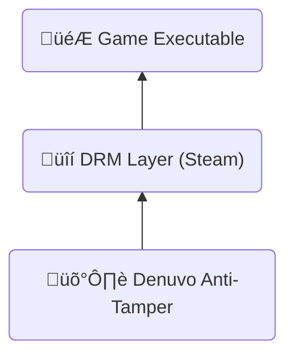

---
# You can also start simply with 'default'
theme: default
# random image from a curated Unsplash collection by Anthony
# like them? see https://unsplash.com/collections/94734566/slidev
background: ./images/hwl.webp
# some information about your slides (markdown enabled)
title: Reverse Engineering Denuvo in Hogwarts Legacy
class: text-center
# https://sli.dev/features/drawing
drawings:
  persist: false
# slide transition: https://sli.dev/guide/animations.html#slide-transitions
transition: my-transition
# enable MDC Syntax: https://sli.dev/features/mdc
mdc: true
# open graph
# seoMeta:
#  ogImage: https://cover.sli.dev
---

<style>
.my-transition-enter-active,
.my-transition-leave-active {
  transition: opacity 0.1s linear;
}

.my-transition-enter-active {
  transition-delay: 0.1s;
}

.my-transition-enter-from,
.my-transition-leave-to {
  opacity: 0;
}
</style>

<style scoped>
.slidev-layout {
    padding: 0px;
}

h1 {
  color: rgba(255, 255, 255, 0.95);
  text-shadow: 0px 0px 0.3em rgba(0, 0, 0, 0.381);
  box-shadow: rgba(0, 0, 0, 0.24) 0px 3px 8px;
}

h1 img.denuvo-logo {
  display: inline;
  transform: translateY(-0.05em);
  width: 180px;
  filter: invert() drop-shadow(0px 0px 0.1em rgba(0, 0, 0, 0.575));
}

h1 img.hwl-logo {
  display: inline;
  transform: translateY(-0.2em);
  width: 220px;
  filter: invert() drop-shadow(0px 0px 0.1em rgba(0, 0, 0, 0.575));
}
</style>
<h1 class="mt--70 backdrop-blur-xl p-9 text-shadow-3xl">
Reverse Engineering
<br>
 in 
</h1>

---

# Who am I?

<div class="flex">

- Maurice Heumann
- Cybersecurity Engineer @ Thales
- Cracked & modded Call of Duty games (BOIII, XLabs)
- Twitter: @momo5502

<div class="flex-1 text-center">

</div>
</div>

---

# Agenda

- Understanding Denuvo
- Cracking the Game
- Performance Reasoning

---
layout: center
---

# Understanding Denuvo

---

# What is Denuvo?

<div class="flex" m="t-2">

<div>

- **Anti-tamper solution** by Irdeto
- **Not a DRM itself** - protects existing DRM systems
  - Steam, Origin, Epic Games Store, etc.
- **Used by major publishers**: EA, Ubisoft, Square Enix, Capcom
- **Controversial**: Loved by publishers, hated by pirates

→ Strongest Game Protection to date

</div>

<div class="text-center flex-1">



</div>
</div>

---
clicks: 13
---

# How does Denuvo work?

<v-clicks every="0.5">

1. Hardware fingerprint is generated → Computername + Username + ...
2. Steam ticket generation → Proof of game ownership
3. Fingerprint & Steam ticket is sent to Denuvo server
4. Server validates steam ticket → Do you really own the game?
5. Server generates Denuvo token for the fingerprint
6. Game runs with Denuvo token

</v-clicks>

<div class="flex mt-6 text-shadow-xl"
  v-motion
  :initial="{ x: 0, y: 300 }"
  :enter="{ x: 0, y: 300 }"
  :click-1="{ y: 0 }"
>
<div class="border-3 border-lime p-4 rounded-lg">
🎮 Game
<div class="border-3 border-red-600 rounded-md p-1 m-2"
  v-motion
  :initial="{ x: 0, y: 300 }"
  :enter="{ x: 0, y: 300 }"
  :click-3="{ y: 0 }"
  :click-7="{ x: 660 }"
  >
  🔍 Fingerprint
</div>

<div class="border-3 border-red-600 rounded-md p-1 m-2"
  v-motion
  :initial="{ x: 0, y: 300 }"
  :enter="{ x: 0, y: 300 }"
  :click-5="{ y: 0 }"
  :click-7="{ x: 660 }"
>
  🎟️ Steam Ticket
</div>
<div
  class="absolute font-size-[1.2em]"
  v-motion
  :initial="{ x: 673, y: 300 }"
  :enter="{ x: 673, y: 300 }"
  :click-9="{ x: 673, y: -43 }"
>✅</div>
<div class="border-3 rounded-md p-1 m-2 opacity-0"
>
  🔑 Denuvo Token
</div>
</div>

<div class="flex-1">
</div>

<div class="border-3 border-sky-500 p-4 rounded-lg">
🌐 Denuvo Server

<div class="border-3 rounded-md p-1 m-2 opacity-0"
  >
  🔍 Fingerprint
</div>

<div class="border-3 rounded-md p-1 m-2 opacity-0">
  🎟️ Steam Ticket
</div>

<div class="border-3 border-yellow rounded-md p-1 m-2"
  v-motion
  :initial="{ x: 0, y: 300 }"
  :enter="{ x: 0, y: 300 }"
  :click-11="{ y: 0 }"
  :click-13="{ x: -660 }"
>
  🔑 Denuvo Token
</div>
</div>
</div>

---

# What is the fingerprint?

&nbsp;

Collection of features that uniquely identify the PC:

- Computer name
- Username
- CPU Identifiers
- OS Identifiers
- ...

---

# What is a Denuvo token?

- It's an encrypted/encoded xml file
- Looks like this when decrypted:

```xml {*|1|2|3}
<ai>990080</ai>                                         <!-- App ID: Hogwarts Legacy -->
<ui>5f6d000601001001</ui>                               <!-- Steam User ID -->
<gt>CQBFR0aGA0eM2o ... eXYYW1BGYPLhA_THfJVDAgJ2c=</gt>  <!-- Encoded game token data -->
```

- Only requested from Denuvo servers if fingerprint changed
- Error if token can't be requested (e.g. no game license):
  

---

# What is the Denuvo token used for?

- Game has two phases:
  1. Fingerprint collection + Token generation
  2. Runtime
- Runtime only works with a valid token
- Game continuously validates your PC during gameplay
  - Reads many fingerprint values at thousands of places
  - Values are likely used to encrypt game data
  - Token contains information to decrypt the data again
  - If CPU info doesn't match token, game crashes

---

# What makes Denuvo so strong?

&nbsp;

**Custom Protection Per Game:**

- Each game is unique
- Different fingerprints, patterns, validation
- No generic crack possible

**Advanced Code Protection:**

- No traditional packing → code remains accessible
- **Code virtualization** → critical sections run in custom VM
- **Tight integration** → Denuvo is mixed into game logic
- **Thousands of checks** → validations everywhere

---
layout: center
---

# Cracking the Game

---

# How to approach this?

<v-clicks>

**Two possibilities:**

1. Remove Denuvo from the Game → 🛑 insane
2. Patch Fingerprint to mimic other PC → ✅

**Fingerprint Patching**

- Make Game think it runs on different PC
- Hardcode token for that PC

→ Find all fingerprints and patch every use in the game

</v-clicks>

---

# How to find fingerprint features?

- Denuvo must **communicate** with OS, Hardware, Filesystem, ...
  - Game needs information from somewhere

Three main ways of communication:

- <span class="text-color-yellow">API calls</span>
- <span class="text-color-lime">Reading Memory</span>
- <span class="text-color-sky">Special instructions</span> (CPUID, Syscall, ...)

→ We need a way to easily analyze, instrument and intercept all 3

---

# Userspace Emulation

- Simulate CPU, Memory & OS in Software

Emulator can:

- instrument all <span class="text-color-yellow">API calls</span>
- intercept every <span class="text-color-lime">memory access</span>
- trace all <span class="text-color-sky">instructions</span>

What the emulator can not: emulate graphics -> it won't be able to fully boot into the game
luckily:
Denuvo has two phases:

1. collection phase, before it talks to the server
2. runtime, when the game runs, after server communication

-> emulation analysis only needs to run until the server communication.

---

# <span class="opacity-[0.5]">Category:</span> <span class="text-color-yellow">API calls</span>

**How to find?**

- Breakpoint on every exported function of every DLL
  - super cheap in the emulator
- Log every API call that was done from Hogwarts Legacy

---

# 1. Feature: <span class="text-color-yellow">API calls</span>

#### Emulator logged:


---

# 1. Feature: <span class="text-color-yellow">API calls</span>

- GetVolumeInformationW
- GetUserNameW
- GetComputerNameW
- CryptGetProvParam
- CryptAcquireContextA
- CryptAcquireContextW
- CryptEnumProvidersW
- ExpandEnvironmentStringsA &rarr; %COMPUTERNAME%

---

# 1. Feature: <span class="text-color-yellow">API calls</span>

**How to patch?**

Easy:

- Denuvo has no integrity checks on API calls
- just hook all API calls and return constant values

---

# <span class="opacity-[0.5]">Category:</span> <span class="text-color-lime">Memory Reads</span>

**How to find?**

- Install hook on every memory read in the emulator
- Skip uninteresting access (stack, heap, loaded modules, ...)
- Log interesting reads

---

# 2. Feature: <span class="text-color-lime">Process Environment Block</span>

#### Emulator logged:


---

# 2. Feature: <span class="text-color-lime">Process Environment Block</span>

- OSMajorVersion
- OSMinorVersion
- NumberOfProcessors
- ImageSubsystemMajorVersion
- ImageSubsystemMinorVersion
- ProcessParameters -> Environment
  - Denuvo reads random values in the environment variables
  - Offsets: 0x74, 0x123, 0x1d8, 0x291

---

# 2. Feature: <span class="text-color-lime">Process Environment Block</span>

**How to patch?**

- unprotect memory and overwrite with constant values
- can have undesired side effects (e.g. patching OS version)

→ don't care, it's just a POC ¯\\\_(ツ)\_/¯

---

# 3. Feature: <span class="text-color-lime">KUSER_SHARED_DATA</span>

#### Emulator also logged:


---

# 3. Feature: <span class="text-color-lime">KUSER_SHARED_DATA</span>

- NtProductType
- ActiveProcessorCount
- SuiteMask
- ProductTypeIsValid
- NtMajorVersion
- NtMinorVersion
- NtBuildNumber
- ProcessorFeatures
- NumberOfPhysicalPages

---

# 3. Feature: <span class="text-color-lime">KUSER_SHARED_DATA</span>

--> hard to patch

- find all places -> ideally HWBP + exception handler
- non-linear stack -> wrote a debugger that attaches to the game and traces using HWBP
- no guarantee i'll ever have all locations
- dynamic hook creation
- redirect memory load to fake memory region
- disassemble all load instruction
- analyze and replicate memory source (scale-index-base)
- replicate instruction (xor, add, mov, ...)

---

# <span class="opacity-[0.5]">Category:</span> <span class="text-color-sky">Special Instructions</span>

**How to find?**

- Emulator supports hooks for special instructions (cpuid, syscall, rdtsc, ...)
- Log interesting instructions executed by Hogwarts Legacy

---

# 4. Feature: <span class="text-color-sky">CPUID</span>

#### Emulator logged:


---

# 4. Feature: <span class="text-color-sky">CPUID</span>

- CPUID Leaves
  - 0x1 → CPU Family, Model, ...
  - 0x80000002 → CPU Brand String (e.g. "Genuine Intel")
  - 0x80000003 → -""-
  - 0x80000004 → -""-

→ Leaf 0x1 probably used to conditionally enable other features (xgetbv?)

---
transition: slide-up
---

# 4. Feature: <span class="text-color-sky">CPUID</span>

**How to patch?**

- Too lazy to redo what was done for KUSER_SHARED_DATA

→ Hypervisor

---
transition: slide-down
---

# What is a Hypervisor?

<div class="flex">
<div>

- Driver or standalone Software that enables VMs
- Most VM instructions run on CPU
- Some are intercepted by Hypervisor
  - Hypervisor can register a callback at the CPU

<div v-click>

→ Hypervisor doesn't need to manage VMs

</div>

<div v-click>

- Just register callback (VM exit handler)
- Intercept CPUID VM exit → patch return values

→ Can also have undesired consequences

</div>
</div>
<div class="flex-1 text-center">

</div>
</div>

---

# 5. Feature: <span class="text-color-sky">Inline syscalls</span>

#### Emulator logged:


---
transition: slide-up
---

# 5. Feature: <span class="text-color-sky">Inline syscalls</span>

- NtQuerySystemInformation → SystemBasicInformation
  - NumberOfProcessors
  - NumberOfPhysicalPages
  - TimerResolution
  - ...

→ NTDLL exports are parsed to find syscall ID

---

# 5. Feature: <span class="text-color-sky">Inline syscalls</span>

**How to patch?**

- Denuvo has mini integrity checks on instructions
- instruction bytes are read and computed into other calculations
- bytes need to stay intact → unable to hook
- Hypervisor can perform stealth hooking (EPT hooking)
- Integrity check can not see the hook

→ Want to know more? <a href="https://momo5502.com/ept" target="_blank">momo5502.com/ept</a>

---
layout: center
---

# The last feature...

<div class="text-center">


<span class="opacity-[0.7]">...took me 3 months to find</span>

</div>

---

# 6. Feature: <span class="text-color-red-500">Import integrity</span>

- --> Advapi32.dll
- addresses of these values in IAT
- changing them invalidates the token, so aslr changes on a reboot might invalidate it.

* CryptAcquireContextA
* CryptGetProvParam
* GetUserNameW
* GetVolumeInformationW

--> insanely hard to find. why?
-> regular memory access, nothing special
-> game reads import table all the time, nothing suspicious
-> usually import is used for execution, not in denuvo case

--> simple to patch

- trampolinee at fixed VA that redirects to the original value
- requires that the VA is available, which it should be

---

# It's running...

... after 5 months


---

# Did I manage to fully crack it?

<v-click>

### No.


</v-click>

---

# What does that leave us with?

- Game runs, but semi stable. Why?
  - Sampling KUSD may miss values
  - Patching CPUID & PEB destabilizes system
  - Syscall patches likely also incomplete
  - Maybe I overlooked features that don't trigger token error?

→ 2000+ hooks. We can surely do something with that?

- Print when the hooks are triggered
- See in which situations Denuvo code runs

---
layout: center
---

# Performance Reasoning

---

# Performance Reasoning

- For me, impossible to make detailed measurements --> I would need game without denuvo and with denuvo
- denuvo changes a lot, each game is protected differently, even different versions of the game, each integration is different.
- denuvo has a dedicated team that performs integration into games
- prior analysis mostly meaningless, has to be looked at for each game invidivually

* each of my 2000 hooks prints when it's called
* if no print occurs, no denuvo verification code runs --> very likely no possibility of performance impacts
* video a few prints during normal gameplay
* lots of prints during transition/loadscreen

---

# Performance Reasoning

<Youtube id="6JriEmiZ1t0" width="720" height="405" />

---

# Summary

- Patching it requires thousands of hooks
- Integration is different for each game
- Finding fingerprint features is conceptually hard
- Patching fingerprint is conceptually easy, but takes huge amount of time
  - No real incentive to spend the time
- As a researcher, you are happy you found the fingerprints, you don't care about patching all of them
- This makes denuvo so strong
  - they make the easy challenge look hard and the hard challenge look easy
