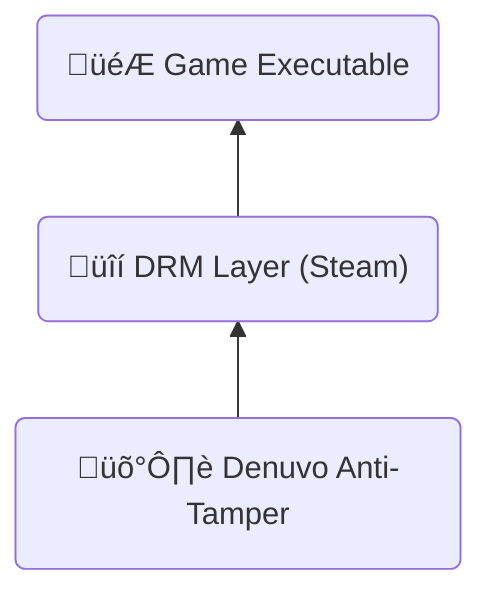

---
# You can also start simply with 'default'
theme: default
# random image from a curated Unsplash collection by Anthony
# like them? see https://unsplash.com/collections/94734566/slidev
# some information about your slides (markdown enabled)
title: Reverse Engineering Denuvo in Hogwarts Legacy
class: text-center
# https://sli.dev/features/drawing
drawings:
  persist: false
# slide transition: https://sli.dev/guide/animations.html#slide-transitions
transition: my-transition
# enable MDC Syntax: https://sli.dev/features/mdc
mdc: true
# open graph
# seoMeta:
#  ogImage: https://cover.sli.dev
---

<style>
.my-transition-enter-active,
.my-transition-leave-active {
  transition: opacity 0.1s linear;
}

.my-transition-enter-active {
  transition-delay: 0.1s;
}

.my-transition-enter-from,
.my-transition-leave-to {
  opacity: 0;
}

.macos-window {
  border-radius: 7px;
  background: #424242;
  border: 1px solid #424242;
}

.macos-window > *:last-child {
  border-bottom-left-radius: 6px;
  border-bottom-right-radius: 6px;
}

.macos-bar {
  display: flex;
  justify-content: center;
  padding-left: 5px;
}

.macos-button {
  display: inline-block;
  border-radius: 50%;
  width: 10px;
  height: 10px;
  margin: auto;
  margin-left: 6px;
}

.macos-close {
  background:rgb(254, 111, 111);
}

.macos-minimize {
  background:rgb(255, 199, 88);
}

.macos-maximize {
  background:rgb(92, 236, 130);
}

.macos-url-bar {
  flex: 1;
  background: #565656;
  margin: 8px;
  font-size: 0.6em;
  margin-left: 25px;
  border-radius: 4px;
  padding: 4px;
  padding-left: 6px;
  font-family: monospace;
}

.scaled-frame {
  transform: scale(0.5);
  transform-origin: 0 0;
  width: 200%;
  height: 200%;
}
</style>

<style scoped>
.slidev-layout {
    padding: 0px;
}

h1 {
  color: rgba(255, 255, 255, 0.95);
  text-shadow: 0px 0px 0.3em rgba(0, 0, 0, 0.381);
  box-shadow: rgba(0, 0, 0, 0.24) 0px 3px 8px;
}

h1 img.denuvo-logo {
  display: inline;
  transform: translateY(-0.05em);
  width: 180px;
  filter: invert() drop-shadow(0px 0px 0.1em rgba(0, 0, 0, 0.575));
}

h1 img.hwl-logo {
  display: inline;
  transform: translateY(-0.2em);
  width: 220px;
  filter: invert() drop-shadow(0px 0px 0.1em rgba(0, 0, 0, 0.575));
}

img.main-background {
  width: 100%;
  position: fixed;
  top: 0;
  left: 0;
  right: 0;
  bottom: 0;
  object-fit: cover;
}
</style>

<h1 class="mt--70 backdrop-blur-xl p-9 text-shadow-3xl">
Reverse Engineering
<br>
 in 
</h1>

---

# Who am I?

<div class="flex">

- Maurice Heumann
- Cybersecurity Engineer @ Thales
- Used to mod COD games (BOIII, XLabs)
- Twitter: @momo5502

<div class="flex-1 text-center">

</div>
</div>

---

# Agenda

- Understanding Denuvo
- Bypassing Denuvo
- Performance Reasoning
- Analysis Demo

---
layout: center
---

# Understanding Denuvo

---

# What is Denuvo?

<div class="flex" m="t-2">

<div>

- Anti-tamper solution by Irdeto
- Not a DRM itself
  - Protects existing DRM systems
  - Steam, Origin, Epic Games Store, etc.

→ Strongest game protection to date

</div>

<div class="text-center flex-1">



</div>
</div>

---
clicks: 13
---

# How does Denuvo work?

<v-clicks every="0.5">

1. Hardware fingerprint is generated → Computername + Username + ...
2. Steam ticket generation → Proof of game ownership
3. Fingerprint & Steam ticket is sent to Denuvo server
4. Server validates steam ticket → Do you really own the game?
5. Server generates Denuvo token for the fingerprint
6. Game runs with Denuvo token

</v-clicks>

<div class="flex mt-6 text-shadow-xl"
  v-motion
  :initial="{ x: 0, y: 300 }"
  :enter="{ x: 0, y: 300 }"
  :click-1="{ y: 0 }"
>
<div class="border-3 border-lime p-4 rounded-lg">
🎮 Game
<div class="border-3 border-red-600 rounded-md p-1 m-2"
  v-motion
  :initial="{ x: 0, y: 300 }"
  :enter="{ x: 0, y: 300 }"
  :click-3="{ y: 0 }"
  :click-7="{ x: 660 }"
  >
  🔍 Fingerprint
</div>

<div class="border-3 border-red-600 rounded-md p-1 m-2"
  v-motion
  :initial="{ x: 0, y: 300 }"
  :enter="{ x: 0, y: 300 }"
  :click-5="{ y: 0 }"
  :click-7="{ x: 660 }"
>
  🎟️ Steam Ticket
</div>
<div
  class="absolute font-size-[1.2em]"
  v-motion
  :initial="{ x: 673, y: 300 }"
  :enter="{ x: 673, y: 300 }"
  :click-9="{ x: 673, y: -43 }"
>✅</div>
<div class="border-3 rounded-md p-1 m-2 opacity-0"
>
  🔑 Denuvo Token
</div>
</div>

<div class="flex-1">
</div>

<div class="border-3 border-sky-500 p-4 rounded-lg">
🌐 Denuvo Server

<div class="border-3 rounded-md p-1 m-2 opacity-0"
  >
  🔍 Fingerprint
</div>

<div class="border-3 rounded-md p-1 m-2 opacity-0">
  🎟️ Steam Ticket
</div>

<div class="border-3 border-yellow rounded-md p-1 m-2"
  v-motion
  :initial="{ x: 0, y: 300 }"
  :enter="{ x: 0, y: 300 }"
  :click-11="{ y: 0 }"
  :click-13="{ x: -660 }"
>
  🔑 Denuvo Token
</div>
</div>
</div>

---

# What is the fingerprint?

&nbsp;

Collection of features that uniquely identify the PC:

- Computer name
- Username
- CPU Identifiers
- OS Identifiers
- ...

→ Varies for each protected game

---

# What is a Denuvo token?

- It's an encrypted/encoded xml file
- Looks like this when decrypted:

```xml {*|1|2|3}
<ai>990080</ai>                                         <!-- App ID: Hogwarts Legacy -->
<ui>5f6d000601001001</ui>                               <!-- Steam User ID -->
<gt>CQBFR0aGA0eM2o ... eXYYW1BGYPLhA_THfJVDAgJ2c=</gt>  <!-- Encoded game token data -->
```

- Belongs to a fingerprint
- Stored on disk
  - Online connectivity required for first launch or if fingerprint changes
<!--- Error if token can't be requested (e.g. no game license):
  -->

---

# What is the Denuvo token used for?

- Game has two phases:
  1. Startup: Fingerprint collection + Token generation
  2. Runtime: Validation
- Runtime only works with a valid token
- Game continuously validates your PC during gameplay
  - Reads fingerprint values
  - Values are likely used to encrypt game data
  - Token contains information to decrypt the data again
  - Game crashes if PC doesn't match token

---

# What makes Denuvo so strong?

- Custom protection for each game
- Different fingerprint features
- Runtime validation at thousands of places

→ No generic crack possible

---
layout: center
---

# Bypassing Denuvo

---

# How to approach this?

<v-clicks>

**Two possibilities:**

1. Remove Denuvo from the Game → 🛑 insane
2. Patch Fingerprint to mimic other PC → ✅

**Fingerprint Patching**

- Replay fingerprint features of different PC
- Hardcode token for that PC

→ Find all features and patch every use in the game

</v-clicks>

---

# How to find fingerprint features?

- Denuvo must **communicate** with OS, Hardware, Filesystem, ...
  - Game needs information from somewhere

Three main ways of communication:

- <span class="text-color-yellow">API calls</span>
- <span class="text-color-lime">Reading Memory</span>
- <span class="text-color-sky">Special instructions</span> (CPUID, Syscall, ...)

→ We need a way to easily analyze all 3

---

# Sogen

- Sogen is a a Windows userspace emulator
- Provides strong instrumentation capabilities → helps analyzing Denuvo
- Check it out: <a href="https://sogen.dev" target="_blank">sogen.dev</a>

<div class="m-auto mt-4 w-150 macos-window shadow-lg">
<div class="macos-bar">
  <span class="macos-button macos-close"></span>
  <span class="macos-button macos-minimize"></span>
  <span class="macos-button macos-maximize"></span>
  <span class="macos-url-bar"><span class="text-color-green">https://</span>sogen.dev</span>
</div>
<!---->
<div class="h-70 w-full overflow-hidden">
<iframe class="scaled-frame" src="https://sogen.dev"></iframe>
</div>
</div>

---
layout: center
---

# Analysis Demo

sogen.dev

---

<style scoped>
.slidev-layout {
    padding: 0px;
}
</style>
<div class="w-[100%] h-[100%] flex flex-col">
<iframe class="flex-1" src="https://sogen.dev" />
<span class="w-1 h-1"></span>
</div>

---

# How to patch: <span class="text-color-yellow">API calls</span>

- Denuvo has no integrity checks on API calls
- Just hook all API calls and return constant values

---

# How to patch: <span class="text-color-lime">Process Environment Block</span>

- Unprotect memory and overwrite with constant values
- Can have undesired side effects (e.g. patching OS version)

→ don't care, it's just a POC ¯\\\_(ツ)\_/¯

---

# How to patch: <span class="text-color-lime">KUSER_SHARED_DATA</span>

- Overwriting memory does not work
- Find all memory reads
  - Sampling using hardware breakpoints and debugger
- Dynamic hook creation at runtime
  - Disassemble sampled accesses
  - Assemble stub that redirects access
  - Redirect access to fake KUSD

---
transition: slide-up
---

# How to patch: <span class="text-color-sky">CPUID</span>

- Too lazy to redo what was done for KUSER_SHARED_DATA

→ Hypervisor

---
transition: slide-down
---

# What is a Hypervisor?

<div class="flex">
<div>

- Driver or standalone software for OS virtualization (VMs)
- Most instructions run on CPU
- Some are intercepted by Hypervisor
  - Hypervisor can register a callback at the CPU

<div v-click>

→ Hypervisor doesn't need to be used for VMs

</div>

<div v-click>

- Just register callback (VM exit handler)
- Intercept CPUID VM exit → patch return values

→ Can also have undesired consequences

</div>
</div>
<div class="flex-1 text-center">

</div>
</div>

---

# How to patch: <span class="text-color-sky">Inline syscalls</span>

- Denuvo has mini integrity checks on instructions
- Bytes need to stay intact → unable to hook
- Hypervisor can perform stealth hooking (EPT hooking)
- Integrity check can not see the hook

→ Want to know more? <a href="https://momo5502.com/ept" target="_blank">momo5502.com/ept</a>

---
layout: center
---

# The last feature...

<div class="text-center">


<span class="opacity-[0.7]">...took me 3 months to find</span>

</div>

---

# 6. Feature: <span class="text-color-red-500">Import integrity</span>

- Addresses of imports in IAT are verified

- advapi32.dll
  * CryptAcquireContextA
  * CryptGetProvParam
  * GetUserNameW
  * GetVolumeInformationW

- Hard to find
  - Looks like regular memory access
  - Game reads import table all the time

---

# 6. Feature: <span class="text-color-red-500">Import integrity</span>

**How to patch?**

- Allocate trampoline at fixed memory location
- Jump to original import

---

# It's running...

... after 5 months


---

# Did I manage to fully crack it?

<v-click>

### No.


</v-click>

---

# What does that leave us with?

- Game runs, but semi stable. Why?
  - Sampling KUSD may miss values
  - Patching CPUID & PEB destabilizes system
  - Syscall patches likely also incomplete
  - Maybe I overlooked features that don't trigger token error?

→ 2000+ hooks. We can surely do something with that?

---
layout: center
---

# Performance Reasoning

---

# Performance Reasoning

- Not a performance measurement!
  - Measurement requires Denuvo-free version (I don't have that)
- Reasoning is based on the hooks
- Denuvo vastly changes for each game
- Analysis for one game likely does not apply to other games

---

# Performance Reasoning

- Each of the 2000+ hooks prints when it's called
  - \[MOMO\] OVERHEAD
- No print → no Denuvo verification code runs
  - → no performance impact possible
- Print → Denuvo verification code runs
  - → impact possible, but unsure how much

---

# Performance Reasoning

<Youtube id="6JriEmiZ1t0" width="720" height="405" />

---

# Performance Reasoning

- Few prints while running / normal gameplay
  - FPS drops unlikely
- Many prints during transitions
  - FPS drops possible → irrelevant

<v-click>

- Denuvo is not constantly hammering your system
- Mostly runs during transitions
- No absolute proof or accurate measurement
- Should only give you a feeling of impact

</v-click>
<v-click>

→ Denuvo likely does not impact gameplay in Hogwarts Legacy

</v-click>

---
layout: center
---

# Summary

---

# Summary

- Patching it requires thousands of hooks
- Integration is different for each game
- Finding fingerprint features is conceptually hard
- Patching fingerprint is conceptually easy, but takes huge amount of time
  - No real incentive to spend the time
- As a researcher, you are happy you found the fingerprints, you don't care about patching all of them
- This makes Denuvo so strong
  - they make the easy challenge look hard and the hard challenge look easy

---
layout: center
---

# Thank you!

<div class="text-center">


<span class="opacity-[0.7]">Questions?</span>

</div>
