---
# You can also start simply with 'default'
theme: default
# random image from a curated Unsplash collection by Anthony
# like them? see https://unsplash.com/collections/94734566/slidev
background: ./images/hwl.webp
# some information about your slides (markdown enabled)
title: Reverse Engineering Denuvo in Hogwarts Legacy
class: text-center
# https://sli.dev/features/drawing
drawings:
  persist: false
# slide transition: https://sli.dev/guide/animations.html#slide-transitions
transition: slide-left
# enable MDC Syntax: https://sli.dev/features/mdc
mdc: true
# open graph
# seoMeta:
#  ogImage: https://cover.sli.dev
---

# Reverse Engineering  in 

---

## Agenda

- Denuvo, what's that?
- Let's crack the game!
- Does performance suck?

---

## Who am I?

- Maurice Heumann
- Cybersecurity Engineer @ Thales
- Twitter: @momo5502

---

## What is Denuvo?

- Anti tamper solution by Irdeto
- Protects existing DRM/licensing solutions
  - e.g. Steam, Origin, ...

```mermaid
flowchart BT
    game(🎮 Game Executable)
    drm("🔒 DRM Layer (Steam)")
    denuvo(🛡️ Denuvo Anti-Tamper)
    drm --> game
    denuvo --> drm
```

---

## How does it work?

---

1. Deuvo generates hardware fingerprint
2. Denuvo/Steam generates a ticket -> proof of game ownership
3. Game sends steam ticket + fingerprint to server
4. Server validates steam ticket
5. Server generates a denuvo token and sends it back
6. Game runs and uses denuvo token to decrypt values at runtime

---

## Bad token

---

# Let's crack the game!

Two ways:

1. Patch and reverse all decryptions
2. Find and patch fingerprint to simulate other PC

--> I chose 2.

So the goal is to find all the features denuvo uses to generate a fingerprint
Then to patch those features to mimic a different PC (with valid denuvo token).

---

## How to find fingerprint features?

Many possible ways

- Debugger
- Hypervisor
- Emulator --> ✅

---

## Why emulator?

Denuvo must communicate with OS, hardware, filesystem, ...
The game needs to grab information from somewhere.
Pretty much three ways:

- API calls
- Special instructions (CPUID, Syscall, ...)
- Memory

An emulator can instrument all that:

- It can trace all API calls
- It can trace all instructions
- It can hook all memory access

What the emulator can not: emulate graphics -> it won't be able to fully boot into the game
luckily:
Denuvo has two phases:

1. collection phase, before it talks to the server
2. runtime, when the game runs, after server communication

-> emulation analysis only needs to run until the server communication.

## Fingerprint features

Vary for each protected game
HWL had 7 Major Categories

1. KUSD values
2. CPUID leaves
3. API calls
4. PEB values
5. Environment peeks
6. Inline syscalls
7. Import integrity

---

## KUSER_SHARED_DATA

- NtProductType
- ActiveProcessorCount
- SuiteMask
- ProductTypeIsValid
- NtMajorVersion
- NtMinorVersion
- NtBuildNumber
- ProcessorFeatures
- NumberOfPhysicalPages

---

## CPUID

- 1
- 0x80000002
- 0x80000003
- 0x80000004

---

## API calls

- GetVolumeInformationW
- GetUserNameW
- GetComputerNameW
- CryptGetProvParam
- CryptAcquireContextA
- CryptAcquireContextW
- CryptEnumProvidersW
- ExpandEnvironmentStringsA &rarr; %COMPUTERNAME%

---

## PEB

- OSMajorVersion
- OSMinorVersion
- NumberOfProcessors
- ImageSubsystemMajorVersion
- ImageSubsystemMinorVersion

---

## Environment Peeks

PEB->ProcessParameters->Environment
essentially random peeks into the env vars

- 0x74
- 0x123
- 0x1d8
- 0x291

---

## Inline syscalls

NtQuerySystemInformation &rarr; SystemBasicInformation

ntdll exports are parsed to find syscall ID

---

### Import integrity

- --> Advapi32.dll
- addresses of these values in IAT
- changing them invalidates the token, so aslr changes on a reboot might invalidate it.

* CryptAcquireContextA
* CryptGetProvParam
* GetUserNameW
* GetVolumeInformationW

---

## How to patch?

Simple ones:

- API calls -> hook them
- PEB, Environment peeks -> data overwritten
  - could have undesired consequences, overwriting the os version or number of cores
- Import integrity -> trampolinee at fixed VA that redirects to the original value
  - requires that the VA is available, which it should be
- KUSD

  - hard to patch
  - find all places -> ideally HWBP + exception handler
  - non-linear stack -> wrote a debugger that attaches to the game and traces using HWBP
  - no guarantee i'll ever have all locations

  - dynamic hook creation
  - redirect memory load to fake memory region
  - disassemble all load instruction
  - analyze and replicate memory source (scale-index-base)
  - replicate instruction (xor, add, mov, ...)

- CPUID

  - load hypervisor -> custom CPUID vmexit handler for hogwarts legacy
  - patch xgetbv bits

- Inline syscalls
  - KUSD approach doesn't work -> mini integrity checks on instructions
    - instruction bytes are read and computed into other calculations
    - bytes need to stay intact
      --> hypervisor + ept hooks -> redirect syscalls to custom handler that replays original data
      --> syscall hooks would've also worked, but my hypervisor couldn't do that at the time

---

## Performance?

- For me, impossible to make detailed measurements --> I would need game without denuvo and with denuvo
- denuvo changes a lot, each game is protected differently, even different versions of the game, each integration is different.
- denuvo has a dedicated team that performs integration into games
- prior analysis mostly meaningless, has to be looked at for each game invidivually

* each of my 2000 hooks prints when it's called
* if no print occurs, no denuvo verification code runs --> very likely no possibility of performance impacts
* video a few prints during normal gameplay
* lots of prints during transition/loadscreen

---

## Performance?

<Youtube id="6JriEmiZ1t0" width="720" height="405" />
